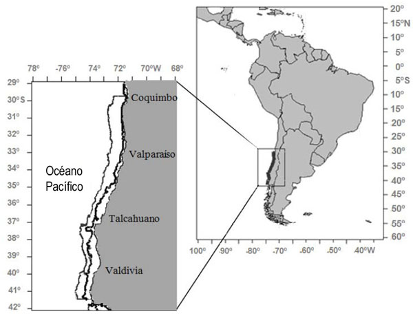

\pagebreak

# 1. ANTECEDENTES

## 1.1. Descripción y objetivo del documento

Este documento contiene el flujo de análisis y modelación de los distintos escenarios de *Merluccius gay* merluza común para la zona centro sur de Chile como parte de la asesoría técnica que lleva a cabo el IFOP, mediante el Grupo Técnico Demersal y Crustáceos del Departamento de Evaluación de Recursos.

# 2. METODOLOGÍA

## 2.2. Área de estudio y pesquería

La pesquería de merluza común se inició en 1938 en Valparaíso y San Antonio con desembarques cercanos a 10 mil toneladas. Los desembarques alcanzaron 90 mil toneladas a mediados los años 50s y luego se estabilizaron en aproximadamente 80 mil toneladas. En los años 60s la mayor parte de los desembarques de este recurso eran empleados en la elaboración de harina de pescado y se caracterizaron por exhibir grandes fluctuaciones. En el año 1968 la pesquería de merluza común alcanzó un primer máximo histórico en los desembarques con 128 mil toneladas. Los desembarques experimentaron luego una notable reducción en los años 70, alcanzando un valor medio de 31 mil toneladas que se mantuvo entre los años 1975 y 1987. En estos años se observa también una reducción en el rendimiento de pesca de la región de Valparaíso, un desplazamiento hacia el sur de la operación de la flota de arrastre y el ingreso de barcos de mayor potencia y autonomía que establecieron su puerto base en Talcahuano [@IFOP2022].

```{r echo=FALSE, out.width = "80%", fig.align='center', fig.cap= "Zona de estudio merluza común Assessment"}

```

\pagebreak

## 2.3. Datos utilizados

Esta evaluación del stock de merluza común incluyó los siguientes conjuntos de datos:

a.   Flota industrial (arrastre de fondo)

- Capturas/desembarques 1940 -- 2020

- Composiciones de edad 1968 -- 2020.

- Pesos medios a la edad 1968 -- 2020.

b.  Crucero de evaluación directa

- Estimaciones de biomasa 1995, 1997, 1999 - 2002, 2004 - 2020, preliminar 2021.

- Composiciones de edad 1995, 1997, 1999 - 2002, 2004 - 2020, preliminar 2021.

- Pesos medios a la edad 1995, 1997, 1999 - 2002, 2004 - 2020, preliminar 2021.

- Captura por unidad de área (CPUA; kg/km2) de jibia 1999 - 2002, 2004 -- 2018, 2021.

c. Capturas

- Serie de desembarques oficiales y serie estimada por el comité científico técnico 1940 - 2019.

- Información de descartes y subreportes proporcionada por los proyectos de monitoreo del descarte y de la pesquería demersal centro sur

Este esquema fue descrito en @IFOP2022 y @Subpesca2016.

## 2.4. Modelo de evaluación

El modelo de dinámica poblacional de la reinenta, corresponde a un enfoque de evaluación del tipo estadístico con estructura de edad, donde la dinámica progresa avanzando en el tiempo t, y las capturas son causantes de la mortalidad por pesca F, la mortalidad natural es constante M = 0.33. La relación entre la población y las capturas responde a la base de la ecuación de Baranov, y se consideran para el modelo y estimaciones el rango de edad entre 2 a 14+ (años). Sin embargo, las estimaciones del modelo tienen su origen en la edad cero sobre la base de una condición inicial estado estable. La dinámica esta modelada por un reclutamiento tipo Beverton y Holt.

Para avanzar en la implenteación metodológica, se establece con fines comparativos modelo por flotas artesanales, donde un modelo utiliza la información de enmalle artesanal, para luego sumar la flota enmalle artesanal, para terminar incorporando la información de la flota industrial (Tabla 1).

\pagebreak

| Escenario | Descripción                             |
|-----------|-----------------------------------------|
| s1        | flota industrial                        |
| SA        | Flota Artesanal e Indistrial            |
| s3        |                                         |
| s4        |                                         |
| s5        |                                         |

## 2.5. Plataforma de modelación

Los modelos implementados fueron configurados utilizando Stock Synthesis (SS3 de aqui en mas)(<https://vlab.noaa.gov/web/stock-synthesis>), que es un modelo de evaluación de stock edad y talla estrucuturado, en la clase de modelo denominado "Modelo de análisis integrado". SS tiene un sub-modelo poblacional de stock que simula crecimiento, madurez, fecundidad, reclutamiento, movimiento, y procesos de mortalidad, y sub-modelos de observation y valores esperados para diferentes tipos de datos. El modelo es codificado en C++ con parámetros de estimación activados por diferenciación automática (ADMB) [@Methot2013]. El análisis de resultados y salidas emplea herramientas de R e interfase gráfica de la librería *r4ss* (<https://github.com/r4ss/r4ss>) [@Taylor2019].

Se realiza una modelación con la plataforma SS3 (V.3.30.19) y sus outputs leídos con la librería "r4ss" [@Taylor2019]


\pagebreak

# 3. RESULTADOS

Instalación de las librerias necesarias

```{r eval=TRUE, echo=F}
# en caso no se tengan las dependencias
# install.packages("devtools")
# devtools::install_github("r4ss/r4ss", ref="development")
# install.packages("caTools")
# library("caTools")
# # install.packages("r4ss")
library(r4ss)
library(here)
#remotes::install_github("PIFSCstockassessments/ss3diags")
library(ss3diags) # diagnosticos del modelo
library(ss3sim) # evaluación de sesgo
```

## 3.1. Principales salidas de modelos y variables poblacionales

Los componentes de verosimilitud, además de los análisis de residuales permiten identificar entre los bloques de modelos cuales de las configuraciones presenta un desempeño adecuado en términos estadísticos de ajuste a la información.

Estos modelos, son los seleccionados para presentar en sus principales salidas para fines informativos de indicadores, puntos biológicos de referencia y estimaciones poblacionales.

```{r eval=FALSE}
# Es posible correr todos los modelos juntos
path.1<- file.path(here(c("s1", "S1")))
list.files (path =path.1)

# otra forma de correr
r4ss::run_SS_models(dirvec = path.1, model = './ss_osx', 
                    skipfinished = FALSE)
# Considerar que al correr el modelo dentro de cada `chunk` se cambia el directorio.
```

### 3.1.1. Mod s1 (Flota Industrial)

Corro escenario por separado 1 Full data

```{r eval= F, message=FALSE, warning=FALSE, include=FALSE}
dir1<-here("s1")
#setwd(dir1)
#dir()
#system('./ss_osx') 
r4ss::run_SS_models(dirvec = dir1, model = './ss_osx', 
                    skipfinished = FALSE)
```


Data disponible para este escenario. 

```{r eval=FALSE}
SSplotData(base.model3, subplot = 2, 
           fleetnames = c("Espinel", "Enmalle"),
           fleetcol = c(2,5))
```

```{r eval=F}
SSplotCatch(base.model3, subplots = 2, fleetnames = c("Espinel", "Enmalle"),
            fleetcols = c(2,5), forecastplot = T)
```

Respecto a los valores y parametros biologicos modelados, los siguientes graficos identifican los estimadores puntuales del recurso

```{r eval=FALSE}
SSplotBiology(base.model3, subplots =1, labels = c("Length (cm)", "Age (yr)", "Maturity", "Mean weight (kg) in last year",
    "Spawning output", "Length (cm, beginning of the year)", "Natural mortality",
    "Female weight (kg)", "Female length (cm)", "Fecundity", "Default fecundity label",
    "Year", "Hermaphroditism transition rate", "Fraction females by age at equilibrium"),
 )
```

aporte de las cohortes por año para las capturas.

```{r eval=FALSE}
SSplotCohortCatch(base.model3, subplots = 1)
```

\quad

AJuste de tallas por flota

```{r eval=FALSE}
SSplotComps(base.model3, subplots = 1)
```

Otros plots

```{r eval=FALSE}
SSplotDynamicB0(base.model3, uncertainty = F)
#SSplotSPR(base.model3)
SSplotPars(base.model3)

```

Salida de las biomasas con las dos flotas

```{r eval=FALSE}
SSplotTimeseries(base.model3, subplot = 1)
```

### 3.1.2. Mod SA (todas las flotas)


```{r eval= F,message=FALSE, warning=FALSE, include=FALSE}
dir2<-here("SA/2021")

r4ss::run_SS_models(dirvec = dir2, model = './ss_osx', 
                    skipfinished = FALSE)
```


\pagebreak

# 4. COMPARACION DE MODELOS

(En desarrollo)

```{r eval=FALSE}
#PLOT labels, name of each model run
legend.labels <- c('dir1','dir2','dir3', 'dir4')

#read in all model runs
#note if cover=T you need a hessian; if covar=F you do not need a hessian
biglist <- SSgetoutput(keyvec = NULL, dirvec = c(SSdir1,SSdir2,SSdir3),	getcovar = F)

#create summary of model runs from list above
summaryoutput <- SSsummarize(biglist)

SSplotComparisons(summaryoutput, subplots = 1:20, plot = TRUE,
                  print = T, endyrvec = "default", indexfleets = NULL, indexUncertainty = FALSE,
                  indexQlabel = TRUE, indexQdigits = 4, indexSEvec = "default",
                  indexPlotEach = FALSE, labels = c("Year", "Spawning biomass (t)",
                                                    "Relative spawning biomass", "Age-0 recruits (1,000s)",
                                                    "Recruitment deviations", "Index", "Log index", "1 - SPR", "Density",
                                                    "Management target", "Minimum stock size threshold", "Spawning output",
                                                    "Harvest rate"), col = NULL, shadecol = NULL, pch = NULL,
                  lty = 1, lwd = 2, spacepoints = 10, staggerpoints = 1,
                  initpoint = 0, tickEndYr = TRUE, shadeForecast = TRUE,
                  xlim = "default", ylimAdj = 1, xaxs = "r", yaxs = "r",
                  type = "o", uncertainty = TRUE, shadealpha = 0.1, legend = TRUE,
                  legendlabels = "default", legendloc = "topright",
                  legendorder = "default", legendncol = 1, sprtarg = NULL,
                  btarg = NULL, minbthresh = NULL, pwidth = 6.5, pheight = 5,
                  punits = "in", res = 300, ptsize = 10, cex.main = 1,
                  plotdir = "C:\\Users\\mauricio.mardones\\Documents\\IFOP\\Loco_Assessment_AMERB\\SA_Loco", 
                  filenameprefix = "", densitynames = c("SSB_Virgin","R0"), 
                  densityxlabs = "default", densityscalex = 1,
                  densityscaley = 1, densityadjust = 1, densitysymbols = TRUE,
                  densitytails = TRUE, densitymiddle = FALSE, densitylwd = 1,
                  fix0 = TRUE, new = TRUE, add = FALSE, 
                  par = list(mar = c(5, 4, 1, 1) + 0.1), 
                  verbose = TRUE, mcmcVec = FALSE,
                  show_equilibrium = TRUE)
```

Tablas comparativas

```{r eval=F}
SStableComparisons(summaryoutput,
                   likenames = c("TOTAL", "Survey", "Length_comp", "Age_comp", "priors",
                                 "Size_at_age"), names = c("Recr_Virgin", "R0", "steep", "NatM",
                                                           "L_at_Amax", "VonBert_K", "SSB_Virg", "Bratio_2017", "SPRratio_2016"),
                   digits = NULL, modelnames = "default", csv = FALSE,
                   csvdir = "C:\\Users\\mauricio.mardones\\Documents\\IFOP\\Loco_Assessment_AMERB\\SA_Loco",
                   csvfile = "parameter_comparison_table.csv", verbose = TRUE,
                   mcmc = FALSE)
```

\pagebreak

# 5. DIAGNÓSTICO

```{r eval=F}

#do retrospective model runs
SS_doRetro(dir4, '', newsubdir = "retrospectives",
           subdirstart = "retro", years = 0:-5, overwrite = TRUE, exefile = "ss",
           extras = "-nox -nohess", intern = FALSE, CallType = "system",
           RemoveBlocks = FALSE)
retroModels <- SSgetoutput(dirvec=file.path(dir4, "retrospectives",paste("retro",0:-5,sep="")))
retroSummary <- SSsummarize(retroModels)


endyrvec <- retroSummary$endyrs + 0:-5
SSplotComparisons(retroSummary, endyrvec=endyrvec, legendlabels=paste("Data",0:-5,"years"),
                  plotdir='month\\',plot=TRUE,print=T)
TableCompare <- SStableComparisons(retroSummary,likenames=like, names=names, 
                                   modelnames=c('B','-1','-2','-3','-4','-5'), csv=TRUE, csvfile="RetroRuns.csv",verbose=FALSE)

```

\pagebreak

# 6. PROGRESO

-   S1. Falta correr modelo implementado

-   s2. Falta correr data solo con enmalle. NO se si esto sea nenecsario para propositos de evaluación dado que este set de datos no se utiliza por si solo

-   s3. Mejorar ajustes de tallas y revisar outputs de variables poblacionales.

-   s4. Modelo solo de espinel. OK.

-   s5. Modelo con indice de biomasas de Zhou no implemetnado.

\pagebreak

# 6. REFERENCIAS
